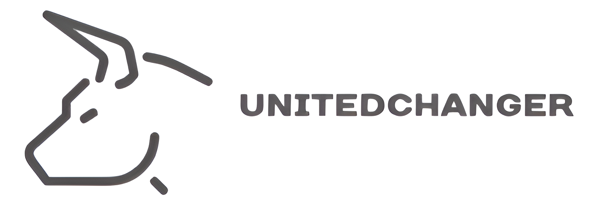

=====================================
🌍 UnitedChangerWeb
=====================================

UnitedChangerWeb — это веб-приложение на Python и Flask, предназначенное для:

- Конвертации валют разных стран
- Построения графиков изменения курсов
- Сохранения таблицы смежности данных валют (их отношений друг к другу)

Приложение использует SQLite для хранения данных и предоставляет удобный веб-интерфейс.

-------------------------------------
🚀 Возможности
-------------------------------------

💱 Конвертер валют
📈 Графики изменений курсов
🧩 Таблица смежности валют
🗃 Хранение истории в базе данных SQLite
🌐 Простая и расширяемая архитектура на Flask

-------------------------------------
🛠️ Используемые технологии
-------------------------------------

- Python 3.11+
- Flask
- SQLite
- Jinja2
- Plotly или Matplotlib (для графиков)
- Requests (для получения данных по API)

-------------------------------------
🔧 Установка и запуск
-------------------------------------

1. Клонируй проект:
   git clone https://github.com/your-username/UnitedChangerWeb.git
   cd UnitedChangerWeb

2. Создай и активируй виртуальное окружение:
   python -m venv venv
   source venv/bin/activate  (или venv\Scripts\activate для Windows)

3. Установи зависимости:
   pip install -r requirements.txt

4. Запусти приложение:
   flask run

Перейди по адресу http://127.0.0.1:5000 в браузере.

-------------------------------------
📁 Структура проекта
-------------------------------------

UnitedChangerWeb/
├── app/
│   ├── __init__.py
│   ├── routes.py
│   ├── models.py
│   ├── templates/
│   └── static/
├── currency_data.db
├── requirements.txt
└── run.py

-------------------------------------
📌 Идеи для развития
-------------------------------------

- Поддержка нескольких валютных API
- Подключение к PostgreSQL/MySQL
- Авторизация пользователей
- Экспорт таблиц в CSV/Excel

-------------------------------------
📜 Лицензия
-------------------------------------

Проект распространяется под лицензией MIT.
